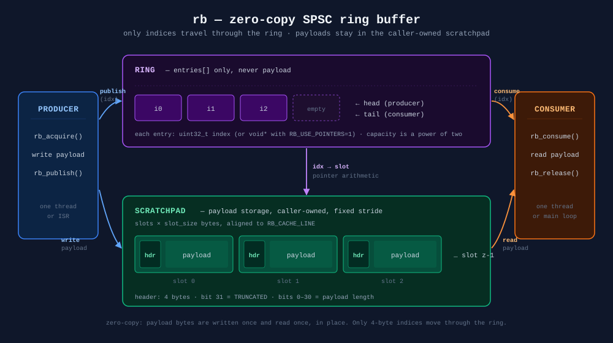
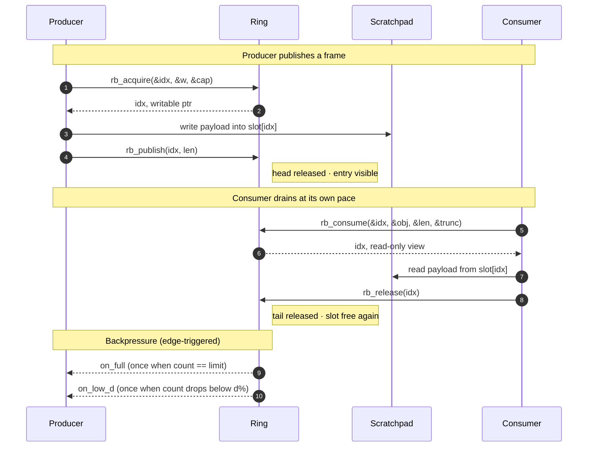

# rb - SPSC ring buffer with scratchpad

A tiny C11 library for a single-producer / single-consumer FIFO of references into a preallocated scratchpad. Zero-copy, dependency-free, cross-compilable to ARM and Android, embeddable on bare metal.

## What it is



A bounded queue that holds indices (or pointers) into a preallocated scratchpad of fixed-size slots. The producer writes directly into a slot, publishes its index, and moves on. The consumer reads directly from the same slot and releases it. No payload is ever copied through the queue. text

```
 producer                          consumer
 --------                          --------
 rb_acquire(&idx, &w, &cap)   ->   (slot busy in producer's hands)
 write into w[0..len)              |
 rb_publish(idx, len)              |
                                   rb_consume(&idx, &obj, &len, &trunc)
                                   read from obj[0..len)
                                   rb_release(idx)
```
The queue stores [i0 | i1 | i2 | ...]. The payloads live in the scratchpad. The ring and the arena are separate, both caller-owned. 

## Why this exists 

The common shape: a fast producer (socket read path, ISR, DMA completion) feeds a slower consumer (transform, parse, forward). You want a bounded buffer that applies backpressure when full instead of growing or dropping, is cheap enough to call on every frame without becoming the bottleneck, works the same on Linux, Android, and (with a switch) bare metal, does not copy payload bytes more than once.

A queue of indices into a fixed-stride arena is the natural answer. This library provides exactly that, with an API small enough to read in one sitting.

## Strengths

- Zero-copy. Payload bytes are written once and read once, in place. Only 4-byte indices (or pointers, if you prefer) travel through the queue.
- No dependencies. Core library uses only stdint.h, stddef.h, stdbool.h, and <stdatomic.h>. No libc, no POSIX, no allocation.
- Caller provides both the control block and the scratchpad.
- Fast. ~22 ns for a full acquire/publish/consume/release cycle on x86_64, at any slot size from 64 B to 8 KB and any capacity from 64 to
- Saturates memory bandwidth around 15 GB/s at 2 KB payloads.
- Correct. Validated under ThreadSanitizer (no races) and AddressSanitizer + UBSan (no UB, no out-of-bounds). 2 M-item SPSC stress test with no loss, no duplication, strict FIFO.
- Small. Static library is a few KB. RB_SINGLE_THREADED=1 compiles away atomics and barriers, leaving a plain circular FIFO with a mask.
- Cross-compile ready. CMake toolchain files for ARM Linux and Android arm64 are included. No host assumptions in the core.
- Configurable at compile time and runtime. Compile-time macros change ABI (entry type, cache-line padding, stats). Runtime setters override policy (capacity, limit, thresholds, callbacks, stack sizes)  without recompiling.
- Callback model that doesn't fight you. Threshold callbacks (on_full, on_low_d, on_low_e) are latched — they fire once when the ring enters the warning region, not on every refill. That is the useful backpressure signal. The consumer path is callback-free: rb_drain runs flat out.
- Bounded by design. capacity, slots, slot_size are frozen at init. You cannot accidentally grow the ring under load.

## Weaknesses

Being honest about what this is not:

- SPSC only. Exactly one producer thread and one consumer thread. No MPSC, no MPMC, no work stealing. Adding a second producer will race.
- Fixed-stride slots. Every slot is the same size. A 64-byte frame occupies a 2 KB slot. If your workload has a wide size distribution and memory is tight, you want size classes (multiple rings) or a real arena with a free list — this library is neither.
- Strict FIFO release order. The consumer releases slots in the order it consumed them. Out-of-order release would require a free-list ring and is not implemented. For a straight pipeline this is a non-issue; for a reorder buffer it is a blocker.
- Oversize handling is a policy, not magic. Under the default TRUNCATE policy, a payload larger than slot_size - 4 is written up to capacity and flagged TRUNCATED. The library never silently forwards a partial object as complete, but the caller still has to decide what to do with the flag.
- Not a scheduler. The library never spawns a thread and never owns an event loop. rb_thread.* and rb_notify.* are optional helpers; they exist so you don't have to write them, not because the library wants to be a runtime.
- No dynamic resize. Capacity cannot change after init. limit (the logical max) can change while the ring is empty; nothing else.
- Cache-sensitive. Once capacity * stride exceeds L2, throughput drops ~40%. On a laptop that's roughly an 8 MB working set. Budget accordingly if you raise capacity with large slots.

## Call sequence 

## Call sequence



## No benchmarks against competitors. 

It is not the goal of this project to be the fastest SPSC ring in existence. It aims to be fast, predictable, dependency-free, and easy to reason about.
