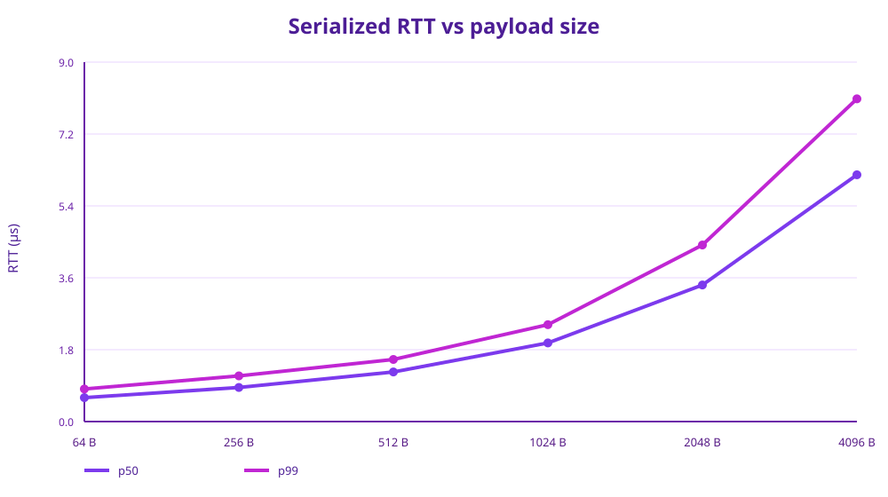
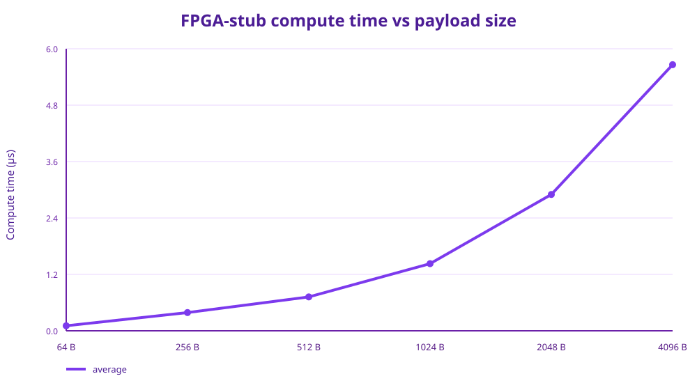
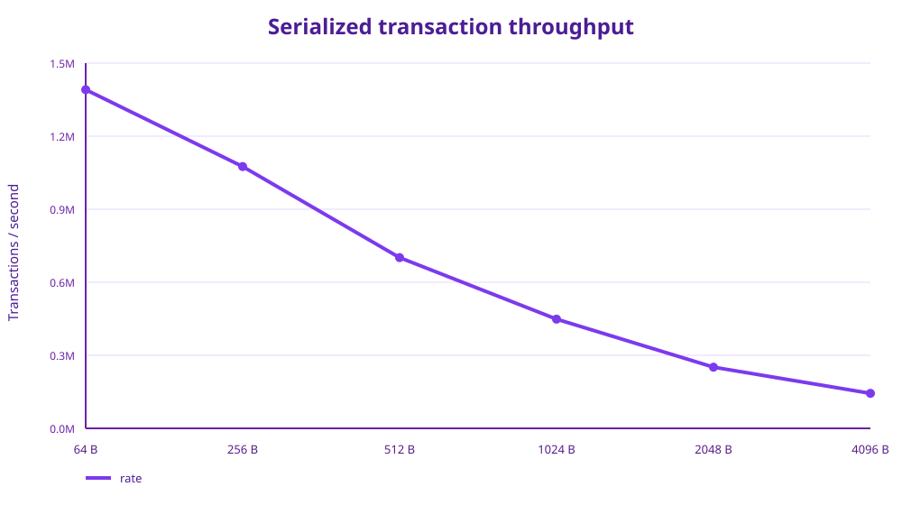
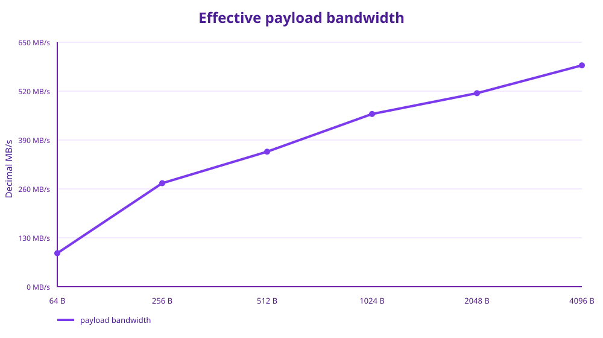

# Zynq offload benchmark analysis

This document records the benchmark data discussed for the `examples/zynq_offload` CPU ↔ shared-memory ↔ FPGA-stub double-ring path.

> **Units:** payload sizes are **bytes**, not bits: 64 B, 256 B, 512 B, 1024 B, 2048 B and 4096 B (512 bit through 32,768 bit).

## Executive summary

The benchmark shows two distinct regimes:

- **Latency:** serialized 64-byte request/response reaches **0.599 µs median RTT** and **0.816 µs p99**.
- **Throughput:** allowing the streaming ring to pipeline work reaches **3.147 M messages/s** for 64-byte messages.
- **Payload bandwidth:** serialized useful payload bandwidth rises from **89.0 MB/s at 64 B** to **588.6 MB/s at 4096 B**.
- **Fixed transport component:** from 256 B through 4096 B, the difference between median RTT and measured FPGA-stub compute averages is remarkably stable at about **0.5 µs**.
- The 4096-byte serialized run therefore spends most of its RTT in payload processing/memory movement rather than the fixed ring/IPC path.

These are measurements of **two ordinary user-space processes communicating through POSIX shared memory**, with `fpga_stub` performing a software FNV-1a workload. They are not measurements of an actual Zynq PL accelerator.

## 1. Serialized round-trip latency

The `-R` benchmark keeps exactly one request outstanding at a time.

| Payload | RTT min (µs) | p10 | p50 | p90 | p99 | p99.9 | Average | Max (µs) |
|---:|---:|---:|---:|---:|---:|---:|---:|---:|
| 64 B | 0.242 | 0.558 | **0.599** | 0.673 | **0.816** | 1.290 | 0.615 | 1,357.071 |
| 256 B | 0.519 | 0.611 | **0.854** | 0.953 | **1.144** | 2.040 | 0.833 | 9,944.813 |
| 512 B | 0.906 | 1.188 | **1.242** | 1.321 | **1.555** | 2.830 | 1.331 | 753,876.607 |
| 1024 B | 1.673 | 1.909 | **1.969** | 2.096 | **2.426** | 5.601 | 2.134 | 794,215.172 |
| 2048 B | 3.146 | 3.320 | **3.420** | 3.687 | **4.421** | 18.761 | 3.876 | 1,234,990.024 |
| 4096 B | 6.003 | 6.114 | **6.179** | 6.868 | **8.081** | 19.908 | 6.854 | 930,077.122 |



### Latency scaling

The median RTT increases from **0.599 µs to 6.179 µs**, a factor of about **10.3×**, while payload increases by **64×**.

That sub-linear relationship is expected because the fixed ring/IPC cost is amortized as the payload becomes larger.

The p99 values remain below 10 µs through 4096 B. The extremely large maximum values are scheduler/system outliers and should not be used as representative latency.

## 2. FPGA-stub compute time

The stub hashes the payload using FNV-1a. `compute_ns` measures the interval between two `clock_gettime(CLOCK_MONOTONIC)` calls surrounding the hash loop.

| Payload | Samples | Min (µs) | Average (µs) | Max (µs) |
|---:|---:|---:|---:|---:|
| 64 B | 20,864,465 | 0.095 | **0.107** | 890.692 |
| 256 B | 16,128,556 | 0.347 | **0.388** | 9,889.151 |
| 512 B | 10,518,520 | 0.689 | **0.721** | 997.695 |
| 1024 B | 6,727,342 | 1.380 | **1.428** | 991.993 |
| 2048 B | 3,768,856 | 2.745 | **2.900** | 1,907.680 |
| 4096 B | 2,155,442 | 5.478 | **5.661** | 2,532.488 |



For 256 B through 4096 B, compute time scales approximately linearly with payload size. The 64 B measurement is dominated more strongly by the fixed timestamp-measurement overhead.

**Important:** these are software-stub numbers, not FPGA execution numbers.

## 3. Serialized transaction throughput

| Payload | Completed transactions | Transactions/s |
|---:|---:|---:|
| 64 B | 20,864,465 | **1,390,964** |
| 256 B | 16,128,556 | **1,075,237** |
| 512 B | 10,518,520 | **701,235** |
| 1024 B | 6,727,342 | **448,489** |
| 2048 B | 3,768,856 | **251,257** |
| 4096 B | 2,155,442 | **143,696** |



The transaction rate falls as messages get larger, but transaction rate alone is misleading because every transaction carries more useful data.

## 4. Effective payload bandwidth

Calculated as:

```
payload_bandwidth = payload_bytes × completed_transactions_per_second
```

| Payload | Tx/s | Payload bandwidth |
|---:|---:|---:|
| 64 B | 1,390,964 | **89.0 MB/s** |
| 256 B | 1,075,237 | **275.3 MB/s** |
| 512 B | 701,235 | **359.0 MB/s** |
| 1024 B | 448,489 | **459.3 MB/s** |
| 2048 B | 251,257 | **514.6 MB/s** |
| 4096 B | 143,696 | **588.6 MB/s** |



The useful payload bandwidth increases by approximately **6.61×** between 64 B and 4096 B.

This is **payload throughput**, not a direct measurement of physical DRAM/interconnect bandwidth. A round trip also entails reading/writing ring metadata, result structures and other memory traffic.

## 5. RTT versus measured compute

| Payload | RTT p50 | Stub compute avg | Difference |
|---:|---:|---:|---:|
| 64 B | 0.599 µs | 0.107 µs | **0.492 µs** |
| 256 B | 0.854 µs | 0.388 µs | **0.466 µs** |
| 512 B | 1.242 µs | 0.721 µs | **0.521 µs** |
| 1024 B | 1.969 µs | 1.428 µs | **0.541 µs** |
| 2048 B | 3.420 µs | 2.900 µs | **0.520 µs** |
| 4096 B | 6.179 µs | 5.661 µs | **0.518 µs** |

The near-constant ~0.5 µs residual from 256 B onward is a particularly useful result. It represents the combined cost of the parts not captured by the stub's `compute_ns` measurement: CPU-side ring operations, shared-memory synchronization, result handling, timestamp placement, and the process-to-process execution path.

It should **not** be interpreted as a pure ring-buffer cost without a no-op control run.

## 6. Streaming 64-byte benchmark

The separate streaming test permits multiple messages to be in flight.

### Capacity 32

| Metric | Result |
|---|---:|
| Published | 45,359,808 |
| Duration | 15.000 s |
| Message rate | **3,023,987 msg/s** |
| Payload bandwidth | **193.5 MB/s** |
| Latency p50 | **0.639 µs** |
| Latency p90 | 0.892 µs |
| Latency p99 | 3.291 µs |
| Latency p99.9 | 10.719 µs |
| Latency average | 1.508 µs |
| Full hits | 213,517,117 |

### Capacity 256

| Metric | Result |
|---|---:|
| Published | 47,209,664 |
| Duration | 15.000 s |
| Message rate | **3,147,311 msg/s** |
| Payload bandwidth | **201.4 MB/s** |
| Latency p50 | **0.622 µs** |
| Latency p90 | 0.870 µs |
| Latency p99 | 13.099 µs |
| Latency p99.9 | 109.065 µs |
| Latency average | 1.308 µs |
| Full hits | 7,352,601 |

Increasing capacity from 32 to 256 improved streaming throughput by about **4.1%** and dramatically reduced observed full-ring hits. The same run had a worse extreme latency tail, while the median and p90 remained below 1 µs.

## 7. Serialized versus streaming

For 64 B:

| Mode | Rate | Payload bandwidth | Median latency |
|---|---:|---:|---:|
| Serialized `-R` | **1.391 M tx/s** | **89.0 MB/s** | **0.599 µs RTT** |
| Streaming, capacity 32 | **3.024 M msg/s** | **193.5 MB/s** | **0.639 µs** |
| Streaming, capacity 256 | **3.147 M msg/s** | **201.4 MB/s** | **0.622 µs** |

The serialized benchmark measures a deliberately constrained one-request-in-flight path. The streaming benchmark exposes the ring's ability to pipeline independent transactions.

## 8. What the data says about the architecture

### Small messages

At 64 B, the system is latency-dominated:

```
0.599 µs median RTT
0.816 µs p99
1.391 M serialized transactions/s
3.147 M streaming messages/s
```

The FNV-1a stub itself averages only **107 ns**, so the fixed software/IPC path is a substantial part of the total.

### Larger messages

At 4 KiB:

```
6.179 µs median RTT
8.081 µs p99
143,696 serialized transactions/s
588.6 MB/s payload throughput
5.661 µs measured stub compute
```

Here the payload-processing cost dominates and the fixed ~0.5 µs component becomes comparatively small.

### The scaling signature

The compute measurements show approximately linear payload scaling, while the fixed transport contribution stays close to constant:

```
RTT ≈ fixed transport/synchronization cost
      + payload-dependent processing/memory cost
```

That is exactly the sort of scaling behavior expected from a shared-memory ring transport carrying increasingly large contiguous payloads.

## 9. Measurement caveats

1. **The FPGA side is a software stub.** The FNV-1a loop is standing in for accelerator work.
2. **`compute_ns` includes timestamp overhead.** Two `clock_gettime()` calls surround the hash loop.
3. **RTT starts immediately before CPU publish and ends immediately after CPU consume.** The subsequent `rb_release()` is outside the measured interval.
4. **The maximum latency values contain severe scheduler/system outliers.** p50/p99/p99.9 are substantially more informative for this workload.
5. **Payload bandwidth is not bus bandwidth.** It is useful payload bytes per completed serialized transaction per second.
6. **The 64-byte streaming and serialized tests are different workloads.** Streaming permits multiple outstanding messages; `-R` deliberately permits only one.
7. **No-op benchmarking is the next isolation step.** Replacing the FNV stub with a minimal consume→publish path will isolate the transport/ring overhead from payload processing.
8. **For a real Zynq result, CPU↔PL cache maintenance, DMA coherency, AXI latency and actual accelerator execution need to be measured separately.**

## 10. Recommended next benchmark matrix

The next controlled experiment should use the same payload sweep with three FPGA-stub modes:

| Mode | Purpose |
|---|---|
| **NOOP** | Isolate pure ring/shared-memory/process transport |
| **HASH** | Current FNV-1a software baseline |
| **REAL FPGA** | Measure actual accelerator path |

For each mode, collect:

- RTT p50 / p90 / p99 / p99.9
- transaction rate
- payload bandwidth
- FPGA/worker compute time
- ring-full events
- optionally CPU cycles per transaction

That will let the fixed transport component be measured directly instead of inferred from RTT minus the software hash time.

---

### Raw 64 B serialized run

```text
completed=20864465
serialized RTT rate=1390964 transactions/s

RTT:
min=0.242 us
p10=0.558 us
p50=0.599 us
p90=0.673 us
p99=0.816 us
p99.9=1.290 us
avg=0.615 us
max=1357.071 us

FPGA stub compute:
min=0.095 us
avg=0.107 us
max=890.692 us
```

### Raw 256 B run

```text
completed=16128556
rate=1075237 tx/s

RTT:
min=0.519 us
p10=0.611 us
p50=0.854 us
p90=0.953 us
p99=1.144 us
p99.9=2.040 us
avg=0.833 us
max=9944.813 us

compute:
min=0.347 us
avg=0.388 us
max=9889.151 us
```

### Raw 512 B run

```text
completed=10518520
rate=701235 tx/s

RTT:
min=0.906 us
p10=1.188 us
p50=1.242 us
p90=1.321 us
p99=1.555 us
p99.9=2.830 us
avg=1.331 us
max=753876.607 us

compute:
min=0.689 us
avg=0.721 us
max=997.695 us
```

### Raw 1024 B run

```text
completed=6727342
rate=448489 tx/s

RTT:
min=1.673 us
p10=1.909 us
p50=1.969 us
p90=2.096 us
p99=2.426 us
p99.9=5.601 us
avg=2.134 us
max=794215.172 us

compute:
min=1.380 us
avg=1.428 us
max=991.993 us
```

### Raw 2048 B run

```text
completed=3768856
rate=251257 tx/s

RTT:
min=3.146 us
p10=3.320 us
p50=3.420 us
p90=3.687 us
p99=4.421 us
p99.9=18.761 us
avg=3.876 us
max=1234990.024 us

compute:
min=2.745 us
avg=2.900 us
max=1907.680 us
```

### Raw 4096 B run

```text
completed=2155442
rate=143696 tx/s

RTT:
min=6.003 us
p10=6.114 us
p50=6.179 us
p90=6.868 us
p99=8.081 us
p99.9=19.908 us
avg=6.854 us
max=930077.122 us

compute:
min=5.478 us
avg=5.661 us
max=2532.488 us
```

## 11. Bottom line

The current implementation demonstrates a **sub-microsecond median serialized RTT at 64 B**, multi-million-message/s streaming throughput, and nearly **0.59 GB/s of useful payload throughput at 4 KiB** on the software-stub path.

The most valuable next measurement is a **NOOP worker**. That will turn the current inferred ~0.5 µs fixed component into a directly measured transport baseline and make the eventual Zynq FPGA numbers much easier to interpret.
